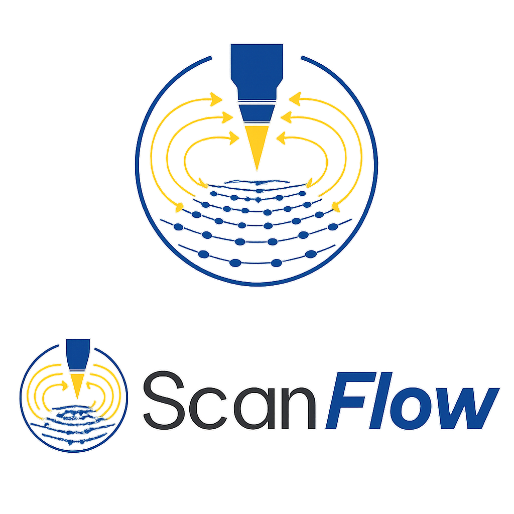

<p align="center">
  
</p>

# ScanFlow

Automated bias / current sweep companion for the CreaTec STM.

ScanFlow runs **alongside** the CreaTec STMAFM software (it does not replace
it). The native software handles live monitoring, image display, and
manual control; ScanFlow handles the things STMAFM doesn't help with —
unattended bias or current sweeps, drift-corrected overnight runs, and a
hard tip-crash safety abort.

## What it does

- **Bias ramp** at constant tunneling current — sweep `V_start → V_end` in steps of e.g. 10 mV.
- **Current ramp** at constant bias — sweep `I_start → I_end` in pA steps.
- **Drift correction** between scans — hybrid algorithm tries feature-centroid tracking first (robust for sparse molecule images), falls back to phase cross-correlation if fewer than 3 features match.
- **0 V bias guard** — steps at |V| < 5 mV are silently skipped in constant-current mode; the feedback loop cannot reach setpoint at zero bias and would crash the tip.
- **Tip-crash safety** — aborts the run and retracts the tip the moment `|I|` exceeds a configurable threshold (default 1 nA).
- **Independent X/Y scan frame sizes** — set non-square frames directly in the GUI.
- **Auto-sync from Createc** — connecting to the STM reads the current scan size, speed, pixels, and setpoint directly from STMAFM and pre-fills the GUI.
- **Emergency stop and Force Quit** — first Stop click is graceful; second click retracts the tip immediately; Force Quit hard-terminates the runner thread as a last resort.
- **Time estimate** shown before every run.
- **Mock STM** for offline testing on any OS.

Two ways to use it:

| Mode | When |
|---|---|
| **GUI** — two-tab window (Sweep / Log) | Interactive setup, click Start |
| **CLI** — `python -m scanflow ...` | Overnight scripts, reproducible runs |

## Installation

```bash
pip install -e ".[createc]"     # Windows with CreaTec COM
pip install -e .                # offline / development
```

## Usage

### GUI

```bash
python -m scanflow
```

Two tabs:
- **Sweep** — scan frame (Size X / Size Y independently), sweep range, drift + safety toggles, Start / Pause / Stop / Force Quit.
- **Log** — running events, drift readings, and errors.

**On connect**, ScanFlow reads the active STMAFM parameters (frame size, speed, pixel count, setpoint) and pre-fills the panel so you don't have to re-enter them.

### CLI

```bash
# Bias ramp from -1.0 V to +1.0 V in 10 mV steps, at 50 pA
python -m scanflow bias --start -1.0 --end 1.0 --step 0.01 --setpoint 50

# Current ramp from 10 pA to 100 pA in 5 pA steps, at 0.1 V
python -m scanflow current --start 10 --end 100 --step 5 --bias 0.1

# Estimate time without running
python -m scanflow estimate bias --start -1.0 --end 1.0 --step 0.01

# Run a saved recipe
python -m scanflow run overnight.yaml
```

Common flags:

| Flag | Meaning | Default |
|---|---|---|
| `--size` | Scan side length (nm, square) | 50 |
| `--speed` | Scan speed (nm/s) | 50 |
| `--pixels` | Resolution per side | 256 |
| `--safety-nA` | Tip-crash threshold | 1.0 |
| `--no-drift` | Disable drift correction | drift on |
| `--no-safety` | Disable safety abort (not recommended) | safety on |
| `--save-folder` | Output directory | STMAFM default |
| `--mock` | Use mock STM (offline) | live |
| `--yes` / `-y` | Skip confirmation | prompt |

Every command prints the plan and estimated total time before starting:

```
=== ScanFlow plan: Bias ramp -1.00–1.00 V ===
  Mode      : Bias ramp -1.000 → 1.000 V  step 10.0 mV  @ 50.00 pA
  Scans     : 200  (0 V step skipped automatically)
  Frame     : 50.0 × 50.0 nm, 256 × 256 px @ 50.0 nm/s
  Per scan  : ≈ 8 min 36 s
  Drift     : on   (adds ~50% alignment time)
  Safety    : on, threshold 1.000 nA
  Estimated total time: 43 h 0 min

Proceed? [y/N]
```

## Drift correction

When enabled, each data scan is preceded by an unpublished **alignment scan**:

1. A full scan runs at the same parameters but is not saved to disk.
2. The alignment frame is compared to the first scan of the series (the reference).
3. A pixel-shift `(dx, dy)` is computed — first by matching molecule centroids (feature tracking), falling back to phase cross-correlation if fewer than 3 features can be matched reliably.
4. The scan-frame XY offset is nudged by the measured shift.
5. A short settle delay (3 s by default) lets the piezo stabilise before the data scan starts.

This keeps the imaged region spatially registered across the whole sweep — essential for pixel-by-pixel comparison of bias-dependent images.

The method is set per-recipe via `drift_method`: `"phase"`, `"features"`, or `"hybrid"` (default).

## Architecture

```
scanflow/
├── __main__.py            # entry point: GUI if no args, else CLI
├── cli.py                 # argparse-driven sweeps
├── core/                  # CreaTec COM facade (setp/getp API)
│   ├── stm_client.py      #   STMClient — thread-local COM proxies, connect/bind
│   ├── scan.py            #   ScanController — params, start/stop/save, nudge offset
│   ├── feedback.py        #   FeedbackController — bias, setpoint, ramps
│   ├── safety.py          #   SafetyMonitor — current-threshold abort + retract
│   ├── mock_dispatch.py   #   Mock STM for offline development / CI
│   └── (others: coarse, lockin, spectroscopy, afm, lateral, …)
├── drift/
│   └── detector.py        # Hybrid drift: feature tracking + phase cross-correlation
├── automation/
│   ├── recipe.py          # MeasurementRecipe (bias_ramp, current_ramp, …)
│   └── runner.py          # QThread runner — drift, safety, emergency stop
├── gui/
│   ├── main_window.py     # Two tabs: Sweep + Log; auto-sync on connect
│   └── panels/
│       ├── sweep_panel.py # Size X/Y, sweep range, drift/safety, load_from_stm()
│       └── log_panel.py
└── io/
    └── session.py
```

## Tests

```bash
pip install -e ".[dev]"
pytest -v
```

29 tests covering recipes, drift detection (phase and feature tracking), mock STM, safety monitor, and 0 V bias guard.

## License

MIT — see [LICENSE](LICENSE).
