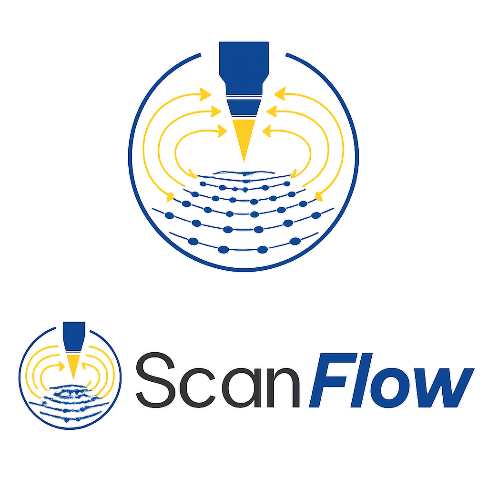

<p align="center">
  
</p>

# ScanFlow2

Semi-automated STM control and measurement portal for CreaTec instruments.

ScanFlow2 is the successor to
[SPMQT-Lab/ScanFlow](https://github.com/SPMQT-Lab/ScanFlow), continuing from
that codebase after a safety/architecture review pass (see
[REVIEW.md](REVIEW.md)) and adopting the layered control/analysis/ML
architecture described in
[docs/long_term_architecture.md](docs/long_term_architecture.md).
The Python package is still imported as `scanflow`.

ScanFlow runs **alongside** the CreaTec STMAFM software (it does not replace
it). STMAFM keeps live monitoring, image display, and manual control;
ScanFlow adds the things STMAFM doesn't help with — unattended sweeps,
automated survey and mosaic campaigns, positioning diagnostics, stability
monitoring, and a hard tip-crash safety abort.

> **This is instrument-control software.** It changes bias, setpoint, scan
> frame, spectroscopy state, and XY offset on a live microscope. Test every
> workflow in mock mode first, and read the *Safety model* section before
> running anything unattended.

## What it does

**Workflows**

- **Bias ramp** at constant current / **current ramp** at constant bias
  (Sweep tab) — with per-step settling and a hard 0 V guard.
- **Survey** — one wide scan, automatic bright-feature discovery, then
  per-feature zoom scans with iterative re-centring. Writes a `survey.json`
  manifest after every feature, so interrupted campaigns stay usable.
- **Mosaic** — wide overview → N×N grid of zoom tiles (optionally a bias
  sweep per tile) → wide overview. Tile positions are absolute, computed
  from the wide frame's offset readback and clamped to stay inside it.
- **Preview / follow-up** — browse incoming scans, detect features
  (ProbeFlow integration), and queue follow-up scans on selected targets.
- **Spectroscopy steps** — single/multi-point I/V inside recipes.
- **Atom tracker** — 5-point Z-gradient drift tracking around a reference
  feature; all moves go through the motion safety layer.
- **Z stability & temperature tabs** — rolling ΔZ statistics and cryostat
  readout.
- **Recipes** — every run is a YAML-serialisable `MeasurementRecipe`
  (scan / spectroscopy / approach / wait / survey / mosaic / tip-form
  steps) with `recipe.validate()` pre-flight checks.

**Safety model**

- **Tip-crash abort**: live `|I|` is polled during scans, waits, and
  settling; exceeding the threshold (default 1 nA) stops the scan,
  activates the Z-limit retract, and ends the run. If the current
  readback itself fails repeatedly, the run aborts rather than continuing
  unprotected.
- **0 V guard**: constant-current steps at |V| < 5 mV are refused — the
  feedback loop would drive the tip into the surface.
- **Motion policy**: automated XY motion goes through `TipMotionManager`
  (scan-idle check, current check, single-move limit, readback
  verification, structured logging).
- **Tip forming**: recipe tip-form steps refuse to execute unless an
  operator explicitly arms one pulse for that specific run
  (`AutomationRunner.approve_next_tip_form()`); there is currently no GUI
  arming path, so recipes containing tip-form steps halt at that step.
- **Stop semantics**: first **Stop** finishes the current scan and halts;
  a **second Stop** is an emergency stop (abort scan + Z-limit retract);
  **Force Quit** hard-terminates the worker as a last resort — STMAFM may
  need restarting afterwards.

> **Known limitation (under validation):** the survey zoom-centering path
> and the mosaic/preview paths make different assumptions about how the
> Createc scan frame behaves when its size changes
> (`SCAN.OFFSET.Y.NM` top-edge convention — see
> `scanflow/core/scan_geometry.py`). Until this is validated on the rig,
> check the first zoom of a survey campaign manually.

## Installation

```bash
pip install -e ".[createc]"     # Windows lab PC with CreaTec COM
pip install -e .                # offline / development (mock mode)
pip install -e ".[analysis]"    # + OpenCV/scikit-learn (ProbeFlow preview)
pip install -e ".[dev]"         # + pytest, pytest-qt, ruff
```

The ProbeFlow preview integration also requires the external `probeflow`
package on the Python path. Heavy ML extras (`[ml]`: torch, CLIP) are not
needed for instrument control.

## Usage

### GUI

```bash
python -m scanflow
```

Toolbar: **Connect STM** (live), **Connect Mock** (simulation — the status
bar shows which one you're on), **Disconnect**, **Preview**.

Tabs: **Sweep · Survey · Mosaic · Positioning Test · Z Stability ·
Temperature · Atom Tracker · Log**.

On connect, ScanFlow reads the active STMAFM parameters (frame size, speed,
pixels, setpoint) and pre-fills the panels.

### CLI

```bash
# Bias ramp from -1.0 V to +1.0 V in 10 mV steps, at 50 pA
python -m scanflow bias --start -1.0 --end 1.0 --step 0.01 --setpoint 50

# Current ramp from 10 pA to 100 pA in 5 pA steps, at 0.1 V
python -m scanflow current --start 10 --end 100 --step 5 --bias 0.1

# Estimate time without running
python -m scanflow estimate bias --start -1.0 --end 1.0 --step 0.01

# Run a saved recipe
python -m scanflow run overnight.yaml
```

Every command prints the plan, runs `recipe.validate()` (errors abort,
warnings are shown), and asks for confirmation unless `--yes`. Common
flags: `--size`, `--speed`, `--pixels`, `--safety-nA`, `--no-safety`
(not recommended), `--save-folder`, `--mock`.

## Output files

Alongside each saved `.dat`, automation runs write:

- `<scan>.scanflow.json` — per-scan sidecar (schema
  `scanflow.acquisition.v1`): recipe/step provenance, scan parameters,
  XY position, motion result, quality metrics, safety status.
- `scanflow_session.json` — per-folder session manifest listing every
  scan and its role.
- `scanflow_acquisition_<stamp>.jsonl` — append-only event log (motion
  attempts, safety readings, aborts, scan starts/saves) for post-run audit.
- Survey/mosaic folders additionally contain `survey.json` manifests and
  PNG previews.

All JSON manifests are written atomically; partial campaigns remain
readable. ProbeFlow consumes these sidecars directly.

## Architecture

```
scanflow/
├── __main__.py / cli.py     # GUI if no args, else argparse CLI
├── contracts/               # stdlib-only shared data models:
│   │                        #   coordinate frames, ScanRecord (= sidecar),
│   │                        #   Feature/AnalysisResult,
│   │                        #   ProposedAction -> Validation -> ValidatedAction
├── core/                    # CreaTec COM facade (setp/getp, SI units)
│   ├── stm_client.py        #   thread-local COM proxies, connect/bind/retry policy
│   ├── scan.py              #   ScanController — params, start/stop/save, offsets
│   ├── scan_geometry.py     #   THE coordinate-convention source of truth
│   ├── motion.py            #   TipMotionManager — policy gate for XY motion
│   ├── safety.py            #   SafetyMonitor — current-threshold abort + retract
│   ├── atom_tracker.py      #   5-point Z-gradient drift tracker
│   ├── mock_dispatch.py     #   Mock STM for offline development / CI
│   └── (coarse, feedback, lockin, spectroscopy, afm, tipform, …)
├── automation/
│   ├── recipe.py            # MeasurementRecipe + validate()
│   ├── runner.py            # QThread runner — steps, safety, emergency stop
│   ├── executors.py         # Qt-free executors (extraction in progress)
│   ├── survey.py / mosaic.py / feature_discovery.py
│   └── workers/             # preview follow-up scan workers
├── gui/                     # main window + per-workflow panels
├── io/                      # sidecars, session manifests, acquisition log, pptx
└── tools/                   # lab-PC monitor utilities
```

Worker threads must call `STMClient.bind_thread()` before touching the
instrument and `unbind_thread()` when done — Win32 COM proxies are
apartment-bound. Physical action commands (start/stop/move/pulse/save) are
never auto-retried; idempotent parameter reads/writes get one transient-COM
retry.

## Tests

```bash
pip install -e ".[dev]"
QT_QPA_PLATFORM=offscreen pytest -q
```

On Anaconda-based setups Qt may fail to locate its platform plugin
(`Fatal Python error: Aborted` when a test creates a `QApplication`).
Point it at PySide6's own plugins:

```bash
export QT_QPA_PLATFORM_PLUGIN_PATH="$(python -c 'import PySide6, os; print(os.path.join(os.path.dirname(PySide6.__file__), "Qt", "plugins", "platforms"))')"
```

The suite (~135 tests) runs entirely against the mock STM: recipes and
validation, 0 V guard, safety thresholds and read-failure handling,
motion limits, scan-geometry helpers, mosaic tile targets, feature
discovery, sidecar schema, and runner integration (graceful stop, safety
abort, tip-form gating).

## License

MIT — see [LICENSE](LICENSE).
